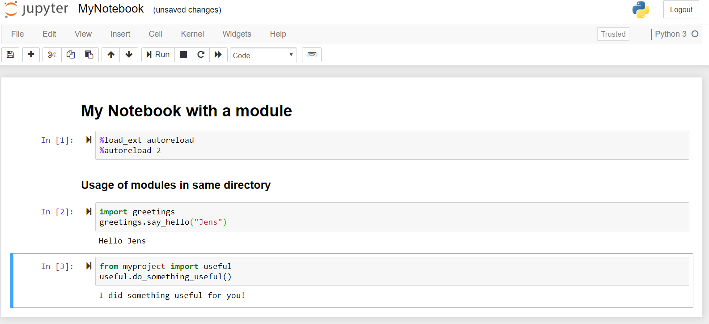

```{r setup, include=FALSE}
knitr::opts_chunk$set(echo = F,
                      message = F,
                      warning = F)
```

Lately I had to develop a predictive model for a client. We all know how it is, you are under pressure to get the things right fast. You craft some Jupyter notebooks to explore the data and to clean it. You build models, go back and forward, move from one to another Notebook and copy code. Sooner or later you end up in a mess. But while I am not so experienced with data science, I have 20 years of experience in software engineering in Java. I felt embarrassed with my working style, because from the perspectitive of my inner software engineer that working style was completely unacceptable. My only excuse was the pressure I was faced to. 

I gave me day to review my code and clean it. There were some mistakes I made. Copy and pasting code is one of the worst practices you can think of. Another mistake was that I was misusing Jupyter Notebooks as an IDE instead what they are actually brilliant for: Taking and presenting notes along with code that is needed to do get things done. Code in Notebooks is difficult to maintain and is not traceable as it does not integrate well into version control systems like Git. I ended up reducing the code in the notebooks to a bare minimum. This made the notebooks clearer. Now I could take the advantages of version controlling of the code with Git and could use my favorite editor. 

There was that one little secret we all know that helped me out and let my code shine again and being completely flexible again:

__M O D U L E S__

This little article is about python modules. You can skip the explaining part. The real power of modules comes with putting them into Git and use Git as source code reporitory and pip repository.

## 1. What is a Python module?

A module is a Python object with arbitrarily named attributes that you can bind and reference. Simply, a module is a file consisting of Python code.

It's easy Python basics. I quickly demonstrate the usage of a module along with a Jupyter Notebook. Moving functionality to a module is simple: We put the code into functions and move this function to new Python file. The advantage of this that we can reduce the code in the notebook. By choosing the function names wisely we  make the code fragments self-explaining without the need of extra comments. 

We can put a module in the same directory as the notebook or we can put into a subdirectory structure to keep multiple modules together in a package.

```code
│   mymodule.py
│   MyNotebook.ipynb
│
├───myproject
│   │   anothermodule.py
```



Jupyter has problems with reloading modules. Adding the following lines on top of your notebook will save you a lot of trouble.

```python
%load_ext autoreload
%autoreload 2
```


```
├───modules
│   └───myproject
│       │   .gitignore
│       │   setup.py
│       │
│       └───myproject
│           │   anothermodule.py
│           │   mymodule.py
│           │   __init__.py
│           │
└───notebooks
    │   MyNotebook-1.ipynb
    │   MyNotebook.ipynb
```


## 3. How to create a Python package in Git and install it from there

```


## 4. Advantages

p

- Easier to ship your code with Docker
- Easier to move from local coding to Colab
- Code can be unit tested
- Usage of IDE for module code
