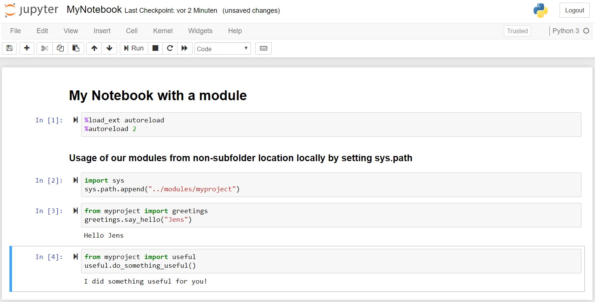
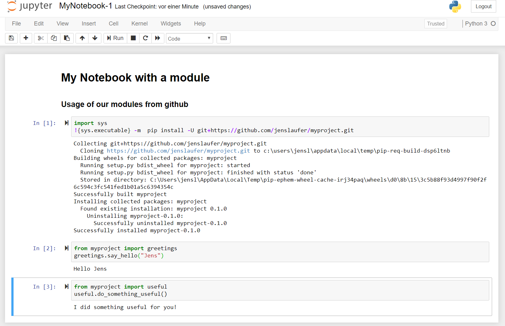

```{r setup, include=FALSE}
knitr::opts_chunk$set(echo = F,
                      message = F,
                      warning = F)
```

Lately I had to develop a predictive model for a client. We all know how it is, you are under pressure to get the things right fast. You craft some Jupyter notebooks to explore the data and to clean it. You build models, go back and forward, move from one to another Notebook and copy code, you move to Colab to easily get additional computer power, build docker containers to ship models. Sooner or later you end up in a mess. I am not so experienced with data science, however I have 20 years of experience in software engineering. I felt embarrassed with my working style, because from the perspectitive of my inner software engineer that working style was completely unacceptable. My only excuse was the pressure I was faced to. 

I gave me a day to review my code and clean it. There were some mistakes I made. Copy and pasting code is one of the worst practices you can think of. Another mistake was that I was misusing Jupyter Notebooks as an IDE instead what they are actually brilliant for: Taking and presenting notes along with code that is needed to do get things done. Yes, I might train models in notebooks, but I think it's bad practice. Code in Notebooks is difficult to maintain and is not traceable as it does not integrate well into version control systems like Git. I didn't write any unit tests as it is impossible in Jupyter.

I ended up reducing the code in the notebooks to a bare minimum. This made the notebooks clearer. Now I could take the advantages of version controlling of the code with Git, could use my favorite IDE again and reusing the code was much easier.

There was that one little secret that helped me out and let my code shine again with a huge gain in flexibility:

__PACKAGES WITH MODULES__

We all know modules and packages, but the real power of packages comes with putting them into a Git repository and use Git as source code repository and pip package repository.

### 1. What is a Python module?

A module is a Python object with arbitrarily named attributes that you can bind and reference. Simply, a module is a file consisting of Python code.

I quickly demonstrate the usage of a module along with a Jupyter Notebook. Moving functionality to a module is simple: We put the code into functions and move this function to a new Python file. The advantage of this that we can reduce the code in the notebook. By choosing the function names wisely we make the code fragments self-explaining without the need of extra comments. 

We can put a module in the same directory as the notebook or we can put into a subdirectory structure to keep multiple modules together in a package.

```code
│   greetings.py
│   MyNotebook.ipynb
│
├───myproject
│   │   useful.py
```

The code in the notebook are now just one or two-liners and the function names make.


Jupyter has problems with reloading modules. Adding the following lines on top of your notebook will save you a lot of trouble.

```python
%load_ext autoreload
%autoreload 2
```


### 2. How to create a Python package in Git and install it from there

The real power of modules comes by moving a package with several modules in it's own Github repository and use it as your pip package repository. For this we refactor a bit our code. We create a modules directory with each module in it's own folder. We put each module in it's own Git repository. All notebooks we put in another Git repository. Now we are able to release versions or create branches of out code.

```code
├───modules
│   └───myproject              --
│       |                       │
│       │   setup.py            │
│       │                       │
│       └───myproject           │ One module in one Git repository
│           │   greetings.py    │ 
│           │   useful.py       │
│           │   __init__.py     │
│           │                  --
└───notebooks                  --
    │   MyNotebook-1.ipynb      │
    │   Modeling.ipynb          │ Notebooks in one Git repository
    |   EDA.ipynb               │
    |                          --
```

We create a setup.py to make the module installable with pip. The setup.py holds information about the module like the version and the author. Important is the install_requires as we add here the modules which are needed to install the module. This way all transitive dependencies are installed along with your module, which makes it a powerful mechanism. 

```python
from setuptools import setup, find_packages

setup(name='myproject',
      version='0.1.0',
      author='Jens Laufer',
      author_email='jenslaufer@jenslaufer.com',
      install_requires=[],
      packages=find_packages()
      )
```

In the folder with the module files is a empty __init.py__, which is needed to install the package in a python enviroment before version 3.3. We can leave it out otherwise.


For local development we got the problem that by moving the modules to a seperate folder our modules can't be found anymore. We need to set the sys.path to the directory where our modules are located to fix this problem.

```python
import sys
sys.path.append("../modules/myproject")
```
Our module will look at the end like this.



We have another powerful option to install the module. We can install it with pip directly from the git repository. Our Git repository is as well our python package repository. All transitive dependencies are installed with the module.

Installing a python package can be done like this. We use Github as our Git service. 

```shell
pip install -U git+https://github.com/jenslaufer/myproject.git
```

In a Jupyter notebook the installation looks like this:




### 3. Advantages

By packaging code in modules and putting it in it's own Git repository we get several advantages:

- We can easily use a package in a local projects/enviroments, but also reuse in other project or environments
- Easier to ship your code with Docker
- Easier to move from local coding to Colab without losing the valuable code history 
- Code in modules can be unit tested, which was difficult in Jupyter notebooks
- Usage of IDE for module code


