### Project Overview

The "A picture is worth a thousand words" stresses how important images
are in the modern world. The quality of images e.g. influences our
decisions in different domains. Especially in eCommerce, where we cannot
touch things they are very important. They have therefore a big
influence on our product purchasing decisions.

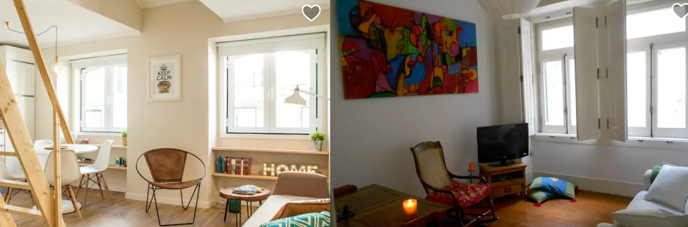

Which room to book?

Which guy to date?

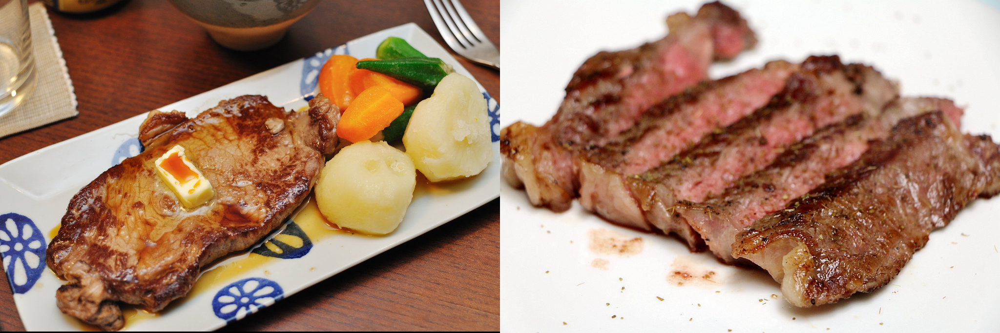

Which food to order?

The goal of this project is to create a model that is able to quantify
the aesthetics of images.

### Problem Statement

The quantification of image quality is an old problem in computer
vision. There are objective and subjective methods to assess image
quality. With objective methods different algorithms quantify the
distortions and degradations in an image. Subjective methods are based
on human perception. The methods often dont't correlate with each other.
Objective methods involve traditional rule-based programming, Subjective
methods are not solvable this way.

The goal of this project is to develop an subjective method of image
quality assessment. As mentioned before this problem cannot be solved
with classical programming. But it seems that supervised machine
learning is a perfect candidate for solving the problem as this approach
learns from examples and it is a way to quantify the ineffeble. A
dataset with image quality annotations is a requirement for learning
from samples.

Within the machine learning ecosystem Convolutional Neural Networks
(CNN) are a category of Neural Networks that have proven very effective
in areas such as image recognition and classification. They are inspired
by biological processes in that the connectivity pattern between neurons
resembles the organization of the human visual cortex.

The subjective quality model will be implemented with a Convolutional
Neural Network as it seems a good fit to tackle the problem.

To solve the problem these steps are needed:

1.  Find a dataset with images with quality annotations
2.  Exploratory Data Analysis (EDA) on the dataset, to evaluate the
    characteristics and suitabilty for the problem space
3.  Cleanup and preprocessing of the dataset
4.  Design a architecture for the CNN
5.  Training of the CNN
6.  Test the model against benchmarks
7.  Analysis of the results

There will be several iterations for the steps 4.-7.

### Metrics

The distribution of user ratings will be predicted in the project. From
there you are able to predict both a quantitative mean rating, but also
a qualitive rating bucket. To capture this two metrics will be used.

#### Earth Mover's distance (EMD)

The **Earth Mover's Distance (EMD)** is a method to evaluate
dissimilarity between two multi-dimensional distributions in some
feature space where a distance measure between single features, which we
call the ground distance is given. The EMD 'lifts' this distance from
individual features to full distributions. It's assumed that a well
performing CNN should predict class distributions such that classes
closer to the ground truth class should have higher predicted
probabilities than classes that are further away. For the image quality
ratings, the scores 4, 5, and 6 are more related than 1, 5, and 10, i.e.
the goal is to punish a prediction of 4 more if the true score is 10
than when the true score is 5. The EMD is defined as the minimum cost to
transport the mass of one distribution (histogram) to the other. (Hou,
Yu, and Samaras 2016)(Rubner, Tomasi, and Guibas 2000)(Talebi and
Milanfar 2018)

$$EMD(P,Q) = \\dfrac{\\sum\\limits\_{i=1}^m \\sum\\limits\_{j=1}^n f\_{ij} d\_{ij}}{\\sum\\limits\_{i=1}^m\\sum\\limits\_{j=1}^n f\_{ij}}$$

#### Accuracy

To compare qualitative results the **Accuracy** is used. The accuracy is
the ratio of correct predictions. In this case the ground-truth and
predicted mean scores using a threshold of 5 on the "official" test set,
as this is the standard practice for AVA dataset.

$$ACC = \\frac{TP+TN}{TP+FP+TN+FN}$$

*T**P* : *T**r**u**e**P**o**s**i**t**i**v**e**s*, *T**N* : *T**r**u**e**N**e**g**a**t**i**v**e**s*, *F**N* : *F**a**l**s**e**N**e**g**a**t**i**v**e**s*, *F**P* : *F**a**l**s**e**P**o**s**i**t**i**v**e*

### Data Exploration

The AVA (Aesthetic Visual Analysis) image dataset which was introduced
by (Murray, Marchesotti, and Perronnin 2012a), (Murray, Marchesotti, and
Perronnin 2012b) is the reference dataset for all kind of image
aesthetics. The dataset contains 255508 images, along with a wide range
of aesthetic, semantic and photographic style annotations. The images
were collected from www.dpchallenge.com.

#### Sample rows

<table>
<thead>
<tr class="header">
<th align="right">image.id</th>
<th align="right">1</th>
<th align="right">2</th>
<th align="right">3</th>
<th align="right">4</th>
<th align="right">5</th>
<th align="right">6</th>
<th align="right">7</th>
<th align="right">8</th>
<th align="right">9</th>
<th align="right">10</th>
<th align="right">rating.mean</th>
<th align="right">rating.sd</th>
</tr>
</thead>
<tbody>
<tr class="odd">
<td align="right">340753</td>
<td align="right">3</td>
<td align="right">2</td>
<td align="right">5</td>
<td align="right">43</td>
<td align="right">100</td>
<td align="right">80</td>
<td align="right">23</td>
<td align="right">10</td>
<td align="right">3</td>
<td align="right">0</td>
<td align="right">5.360595</td>
<td align="right">1.225537</td>
</tr>
<tr class="even">
<td align="right">674342</td>
<td align="right">0</td>
<td align="right">2</td>
<td align="right">4</td>
<td align="right">9</td>
<td align="right">39</td>
<td align="right">56</td>
<td align="right">31</td>
<td align="right">21</td>
<td align="right">15</td>
<td align="right">6</td>
<td align="right">6.355191</td>
<td align="right">1.595610</td>
</tr>
<tr class="odd">
<td align="right">737669</td>
<td align="right">8</td>
<td align="right">16</td>
<td align="right">29</td>
<td align="right">55</td>
<td align="right">81</td>
<td align="right">18</td>
<td align="right">6</td>
<td align="right">0</td>
<td align="right">0</td>
<td align="right">0</td>
<td align="right">4.234742</td>
<td align="right">1.300529</td>
</tr>
<tr class="even">
<td align="right">16606</td>
<td align="right">0</td>
<td align="right">1</td>
<td align="right">13</td>
<td align="right">24</td>
<td align="right">46</td>
<td align="right">55</td>
<td align="right">40</td>
<td align="right">14</td>
<td align="right">5</td>
<td align="right">2</td>
<td align="right">5.770000</td>
<td align="right">1.478885</td>
</tr>
<tr class="odd">
<td align="right">344449</td>
<td align="right">1</td>
<td align="right">6</td>
<td align="right">17</td>
<td align="right">52</td>
<td align="right">91</td>
<td align="right">47</td>
<td align="right">25</td>
<td align="right">6</td>
<td align="right">1</td>
<td align="right">0</td>
<td align="right">5.044715</td>
<td align="right">1.285485</td>
</tr>
</tbody>
</table>

#### Sample images

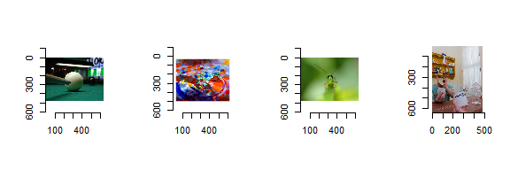

Best rated images

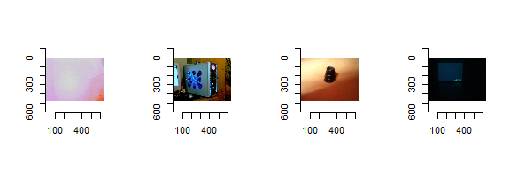

Worst rated images

#### Desciptive Statistics of number of ratings

<table>
<thead>
<tr class="header">
<th align="right"> </th>
<th align="right">value</th>
</tr>
</thead>
<tbody>
<tr class="odd">
<td align="right"><strong>Mean</strong></td>
<td align="right">210.14</td>
</tr>
<tr class="even">
<td align="right"><strong>Std.Dev.</strong></td>
<td align="right">61.51</td>
</tr>
<tr class="odd">
<td align="right"><strong>Min</strong></td>
<td align="right">78.00</td>
</tr>
<tr class="even">
<td align="right"><strong>Q1</strong></td>
<td align="right">164.00</td>
</tr>
<tr class="odd">
<td align="right"><strong>Median</strong></td>
<td align="right">201.00</td>
</tr>
<tr class="even">
<td align="right"><strong>Q3</strong></td>
<td align="right">247.00</td>
</tr>
<tr class="odd">
<td align="right"><strong>Max</strong></td>
<td align="right">549.00</td>
</tr>
</tbody>
</table>

#### Desciptive Statistics of rating.mean

<table>
<thead>
<tr class="header">
<th align="right"> </th>
<th align="right">value</th>
</tr>
</thead>
<tbody>
<tr class="odd">
<td align="right"><strong>Mean</strong></td>
<td align="right">5.38</td>
</tr>
<tr class="even">
<td align="right"><strong>Std.Dev.</strong></td>
<td align="right">0.73</td>
</tr>
<tr class="odd">
<td align="right"><strong>Min</strong></td>
<td align="right">1.81</td>
</tr>
<tr class="even">
<td align="right"><strong>Q1</strong></td>
<td align="right">4.91</td>
</tr>
<tr class="odd">
<td align="right"><strong>Median</strong></td>
<td align="right">5.39</td>
</tr>
<tr class="even">
<td align="right"><strong>Q3</strong></td>
<td align="right">5.87</td>
</tr>
<tr class="odd">
<td align="right"><strong>Max</strong></td>
<td align="right">8.60</td>
</tr>
</tbody>
</table>

### Exploratory Visualization

#### Distribution of number of Ratings

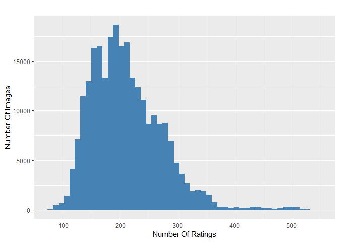

Number of ratings per image: Majority is rated by more than 100 raters

The number of ratings for the images ranges from 78 to 549 with an
average of 210 on a scale from 1 to 10.

It can be seen that all images are rated by a high numbers of raters.
This is very import as rating an image by it's aesthetics is very
subjective. To level out outliers ratings, a high number of raters is
needed.

#### Distribution of Mean Ratings

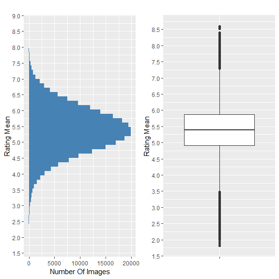

Distribution of rating mean

It can be seen from the distribution and the descriptive statistics that
50% of images has a rating mean within 4.9 and 5.9 and about 85% are
between 3.9 and 6.8. From the boxplot it can be seen that rating means
above 7.2 and below 3.5 are outliers in the way that these values are
very rare.

This is problematic thas the model performance might not sufficient for
images with very good and bad quality.

### Algorithms and Techniques

#### Convolutional Neural Networks (CNN)

A Convolutional Neural Network (CNN) will be used to solve the problem
of image aesthetics assessment. They are deep neural networks inspired
by biological processes and most commonly applied to analyzing visual
imagery.

CNNs consist of an input, an output layer and several hidden layers. The
hidden layers are typically a convolutional layer followed by a pooling
layer.

Structure of a typical CNN for image classification. The network has
multiple filtering kernels for each convolution layer, which extract
features. Subsampling or Pooling layers are used for information
reduction. (Source Wikipedia)

*Convolutional Layer*

The purpose of the convolutional layer is to extract features from the
input image. They preserve the spatial relationship between pixels by
learning image features using small squares of input data.

Convolutional operation to extract features

*Pooling Layer*

Convolutional networks may include pooling layers. These layers combine
the outputs of neuron clusters at one layer into a single neuron in the
next layer. This is done for the following reasons

-   Reduction of memory and increase in execution speed
-   Reduction of overfitting

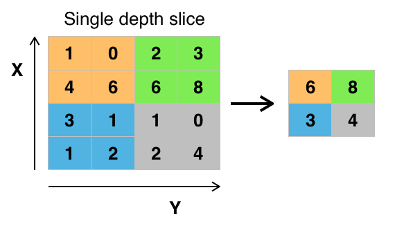

MaxPooling layer, that extracts the maximum value in a region to reduce
information. (Source Wikipedia)

*Fully connected Layer*

After multiple layers of convolutional and pooling layers a fully
connected layer completes the network. The fully connected layer is a
traditional multi layer perceptron responsible for the classification
task.

#### Transfer Learning

Transfer learning is a popular method in computer vision because it
allows to build accurate models in a timesaving way (Rawat and Wang
2017). With transfer learning, instead of starting the learning process
from scratch, you start from patterns that have been learned when
solving a different problem. This way you leverage previous learnings
and avoid starting from scratch.

In computer vision, transfer learning is usually expressed through the
use of pre-trained models. A pre-trained model is a model that was
trained on a large benchmark dataset to solve a problem similar to the
one that we want to solve. Accordingly, due to the computational cost of
training such models, it is common practice to import and use models
from published literature (e.g. VGG, Inception, MobileNet).

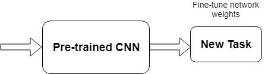

Transfer learning

Several state-of-the-art image classification applications are based on
the transfer learning solutions (He et al. 2016), (Szegedy et al. 2016)
Google reported in it's NIMA (Neural Image Assessment) paper the highest
accuracy with a transfer learning based model (Talebi and Milanfar 2018)

The goal of the project is to use the MobileNet architecture with
ImageNet weights, and the replacement of the last dense layer in
MobileNet with a dense layer that outputs to 10 classes (scores 1 to
10), which form together the rating distribution as suggested by (Talebi
and Milanfar 2018)

### Benchmark

Accuracies of different models on the AVA dataset are reported in
different papers. These accuracies are used for benchmarking the models
which are created in this project. The benchmarks are based on the
"official" AVA test set. The goal is to achieve at least an accuracy of
68% which is above the lower boundary of the relevant papers for image
aesthetics.

<table>
<thead>
<tr class="header">
<th>Model</th>
<th>Reference</th>
<th align="right">Accuracy (2 classes)</th>
<th align="right">EMD</th>
</tr>
</thead>
<tbody>
<tr class="odd">
<td>Murray</td>
<td>(Murray, Marchesotti, and Perronnin 2012b)</td>
<td align="right">68.00%</td>
<td align="right">--</td>
</tr>
<tr class="even">
<td>Reg</td>
<td>(Kong et al. 2016)</td>
<td align="right">72.04%</td>
<td align="right">--</td>
</tr>
<tr class="odd">
<td>DCNN</td>
<td>(Lu et al. 2014)</td>
<td align="right">73.25%</td>
<td align="right">--</td>
</tr>
<tr class="even">
<td>DMA</td>
<td>(Lu et al. 2015)</td>
<td align="right">74.46%</td>
<td align="right">--</td>
</tr>
<tr class="odd">
<td>Schwarz</td>
<td>(Schwarz, Wieschollek, and Lensch 2018)</td>
<td align="right">75.83%</td>
<td align="right">--</td>
</tr>
<tr class="even">
<td>NIMA(MobileNet)</td>
<td>(Talebi and Milanfar 2018)</td>
<td align="right">80.36%</td>
<td align="right">0.081</td>
</tr>
<tr class="odd">
<td>NIMA(Inception-v2)</td>
<td>(Talebi and Milanfar 2018)</td>
<td align="right">81.51%</td>
<td align="right">0.050</td>
</tr>
</tbody>
</table>

III. Methodology
----------------

### Data Preprocessing

The data preprocessing can be devided into two parts: The first part was
done during the exploratory data analysis. In this step the following
checks and cleanings were performed:

1.  Removal of images

    -   Several images had to be removed from meta data as they did not
        exist.

    -   Several corrupted images were identified with a script. The
        corrupted images were deleted from the meta data.

2.  Technical image properties were engineered to check image
    anomalities

    Several technnical image properties (file size, resolution, aspect
    ratio) were engineered and checked for anomalies. No abnormal images
    could be identified here with these properties.

The second preprocessing step is performed during training:

1.  Splitting of the data into training and validation set

    10% of images of the training set are used for validation.

2.  Basemodel specific preprocessing were performed

    Each basemodel provided by Keras offers a preprocessing function
    with specific preprocessing steps for this model. This preprocessing
    step is applied to a ImageGenerator which loads the images for
    training and model evaluation.

3.  Normalization of distribution

    The rating distribution was normalized, because each image was rated
    by a diffrent number of people.

4.  Image resizing and random cropping

    The training images are rescaled to 256 x 256 px and afterwards a
    randomly performed crop of 224 x 224 px is extracted. This is
    reported to reduce overfitting issues. (Talebi and Milanfar 2018)

5.  Undersampling of the data

    For earlier tainings sessions the number of images are reduced by
    cutting the data in 10 rating bins and taking the top n samples of
    each bin. This is done because of two reasons: As the compute power
    is limited this reduces the time to train the model. Another reason
    is that the data is unbalanced. There are just a few images with
    very low and high ratings. It was expected that the undersampling
    reduces the effect of overfitting to the images around the most
    common ratings.

### Implementation

The goal was to create a clear training script which can be
parameterized from outsite for triggering the different trainings. To
reduce the lines of code of this training script, it orchestrates the
building blocks of the training with a pipeline script.

1.  All needed libraries are identified and put into a requirements.txt

2.  An internal library to download the AVA images and the meta data is
    implemented.

3.  A training script was created with building blocks for training
    (loading data, preparing data, train, evaluate)

4.  Building blocks of the training script are moved to a pipeline
    script. The scripts saves different artifacts: Model architecture,
    Model weights, training history, time for training, training
    visualization

5.  A model class is created, which encapsulates the basemodel and top
    model and offers helper functions to change optimizer and freeze
    layers on the fly

6.  The EMD loss function is created

7.  The image generator is created for loading the images and perform
    the preprocessing of the images

8.  Several helper functions for model evaluation are implemented

The actual training is performed in 2 Steps:

1.  Base model weights are frozen and just the top model is trained with
    a higher learning rate

2.  Base model weights are unfrozen and the full network is trained with
    a lower learning rate

#### Model design of the CNN

The model consists as mentioned before of two parts. The base model is
unchanged apart from the first layers which is removed. The model is
initialized with the ImageNet weights. The ImageNet project is a large
visual database designed for use in visual object recognition software
research. The weights for this dataset is used as the images are
similiar to the ones in the AVA dataset. For the base model the
MobileNet architecture is used as this network is smaller to other
networks and suitable for mobile and embedded based vision applications
where there is lack of compute power. (Howard et al. 2017)

The top model consists of two layers. The first layer is a dropout layer
to reduce overfitting, followed by dense layer with a output size of 10
with a softmax activation to predict the distribution of ratings. A Adam
optimizer with different learning rates and learning rate decays is used
for training.

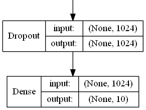

Design of top model: Dropout Layer for avoiding overfitting, Dense layer
with 10 output classes

### Refinement

Several parameters were used for model refinement:

-   Learning rate for dense layers and all layers
-   Learning rate decay for dense layers and all layers
-   Number of epochs for dense layers and all layers
-   Number of images per rating bin used for training
-   Dropout ratio for dropout layer in top model

The training is done in iterative way: First the model is trained with
very few samples and the default values for the parameters above. Then
the model is trained with more samples and the parameters are fine
tuned. After the model is trained the loss value and the accuracy are
calculated for the test set. The accuracy is then compared against the
accuracy scores from the paper (see section Benchmarks) till a
sufficient model accuracy was reached.

The training process is supervised with plots for the loss on the
training and validation set to check if everything works well and to
optimize the learning process.

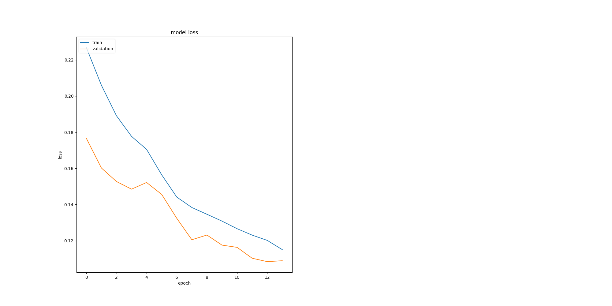

The plots for training history is used to find the best number of epochs
for the two learning phases. During phase 1 validation loss flattens at
epoch 5 (4 in plot ) and in phase 2 the val loss flattens at epoch 8 (12
in plot)

IV. Results
-----------

### Model Evaluation and Validation

Out of the different models model8 was chosen as it's EMD loss value is
the lowest and it's accuracy is the highest among all models on the test
set. The results are trustful, as the test set is the "official" test
set for AVA and the model never saw these images during training or
validation. An interesting fact is that this model performs slightly
better than model9, which was trained with double the amount of training
images.

<table>
<thead>
<tr class="header">
<th align="left">model</th>
<th align="right">acc</th>
<th align="right">emd</th>
</tr>
</thead>
<tbody>
<tr class="odd">
<td align="left">model8</td>
<td align="right">75.22</td>
<td align="right">0.094</td>
</tr>
<tr class="even">
<td align="left">model6</td>
<td align="right">74.89</td>
<td align="right">0.117</td>
</tr>
<tr class="odd">
<td align="left">model9</td>
<td align="right">74.85</td>
<td align="right">0.095</td>
</tr>
<tr class="even">
<td align="left">model5</td>
<td align="right">73.94</td>
<td align="right">0.121</td>
</tr>
<tr class="odd">
<td align="left">model7</td>
<td align="right">70.42</td>
<td align="right">0.105</td>
</tr>
</tbody>
</table>

The best model is based on the MobileNet architecture and the following
parameters are used. All these parameters seem reasonable:

<table>
<thead>
<tr class="header">
<th align="right">Dropout</th>
<th align="right">n training samples</th>
<th align="right">lr(dense)</th>
<th align="right">lr(all)</th>
<th align="right">lr decay(dense)</th>
<th align="right">lr decay(all)</th>
<th align="right">Epochs (dense)</th>
<th align="right">Epochs (all)</th>
</tr>
</thead>
<tbody>
<tr class="odd">
<td align="right">0.75</td>
<td align="right">13914</td>
<td align="right">0.001</td>
<td align="right">3e-05</td>
<td align="right">0</td>
<td align="right">2.3e-05</td>
<td align="right">5</td>
<td align="right">9</td>
</tr>
</tbody>
</table>

It can be seen from the figure below, that the distribution of the
ground truth mean ratings and the predicted mean ratings are very
similiar for the best model. The model works well for mean ratings
between 3.5 and 7.5. Ratings below or above these boundaries are not
covered well by the model. This due the fact, that there are not many
images with very high and low ratings. So model is not capable to rate
these extreme outliers correctly, because of the lack of examples.

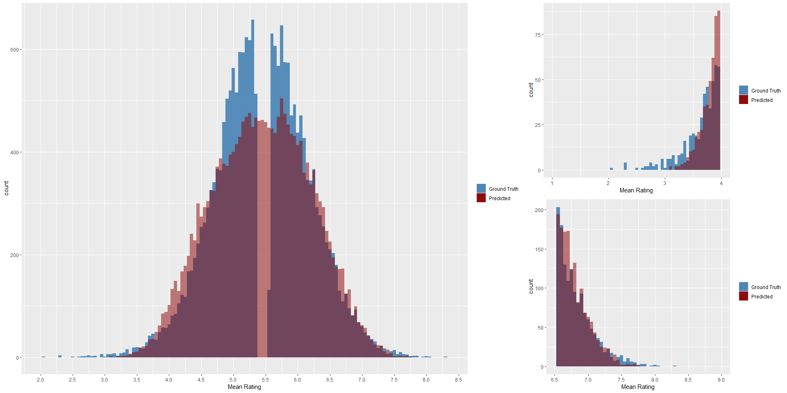

Big figure: Distribution of pedicted mean ratings and ground truth
rating on test set. Small figures: Distribution on lower and upper end
on test set.

### Justification

In comparison to the benchmarks the model shows an moderate accuracy on
the reference test set for AVA which is used throughout all models from
the papers.

The result are quite impressive, as the model was trained with just
13914 images. The models in the papers were trained with the full
training set.

<table>
<thead>
<tr class="header">
<th>Model</th>
<th>Reference</th>
<th align="right">Accuracy (2 classes)</th>
<th align="right">EMD</th>
</tr>
</thead>
<tbody>
<tr class="odd">
<td>Murray</td>
<td>(Murray, Marchesotti, and Perronnin 2012b)</td>
<td align="right">68.00%</td>
<td align="right">--</td>
</tr>
<tr class="even">
<td>Reg</td>
<td>(Kong et al. 2016)</td>
<td align="right">72.04%</td>
<td align="right">--</td>
</tr>
<tr class="odd">
<td>DCNN</td>
<td>(Lu et al. 2014)</td>
<td align="right">73.25%</td>
<td align="right">--</td>
</tr>
<tr class="even">
<td>DMA</td>
<td>(Lu et al. 2015)</td>
<td align="right">74.46%</td>
<td align="right">--</td>
</tr>
<tr class="odd">
<td><strong>My Model</strong></td>
<td><strong>--</strong></td>
<td align="right"><strong>75.22%</strong></td>
<td align="right"><strong>0.094</strong></td>
</tr>
<tr class="even">
<td>Schwarz</td>
<td>(Schwarz, Wieschollek, and Lensch 2018)</td>
<td align="right">75.83%</td>
<td align="right">--</td>
</tr>
<tr class="odd">
<td>NIMA(MobileNet)</td>
<td>(Talebi and Milanfar 2018)</td>
<td align="right">80.36%</td>
<td align="right">0.081</td>
</tr>
<tr class="even">
<td>NIMA(Inception-v2)</td>
<td>(Talebi and Milanfar 2018)</td>
<td align="right">81.51%</td>
<td align="right">0.050</td>
</tr>
</tbody>
</table>

V. Conclusion
-------------

### Free-Form Visualization

For a final quick and dirty test the images from the "Project overview"
section are rated with the model. The images are not part of the AVA
dataset.

Left Image: 4.23 Right image: 3.91

Left Image: 3.27 Right image: 4.00

Left Image: 3.98 Right image: 4.67

It can be seen, that the images which we as a human being would rate
better are also rated better by the model, although the food images are
almost the same quality.

### Reflection

The process used for this project can be summarized using the following
steps

1.  A relevant problem was found
2.  A research for relevant papers was done
3.  Datasets for the problem were researched, analyzed and the best
    suitable dataset was selected
4.  The dataset was cleaned
5.  Model benchmarks were extracted from papers
6.  The technical infrastructure for the project was set up
7.  Models were trained and finetuned and checked against the
    benchmarks, till a good enough model was found, that solves the
    problem

The project was very challanging for me as I had limited compute power
and the dataset is very large. Till the end I was not able to train the
models on the full training set as there were always problems like
running out of memory and Keras and Tensorflow specific problems. I was
at some point stuck, as the models performed badly. After doing an
additional research round I found the Nima paper from Google, which was
so brandnew that it wasn't published when I started the project in july.
The insights from the paper were a breakthrough, especially the usage of
the Earth Movers Loss and the usage of the MobileNet archtitecture for
the base model. I am very proud that I could get a accuracy which was
within the boundaries of the relevant papers and mastered a topic that
is very hot in the moment, especially as I used less images than the
researchers in the papers.

### Improvement

It's very interesting that I did achieve an accuracy within the
boundaries with my undersampling strategy, which was half born out of
need. Even after doing the undersampling of the data the distribution of
the ratings is unbalanced.

A strategy to even perform better would be to do image augmentation on
the underrepresented rated images. This is not so easy, as not every
kind of image augmentation can be used e.g darkening an image may effect
the aesthetics of the image. Another interesting approach would be to
generate images with very high and low rating with GANs
(generative-adversarial-networks).

Another improvement for the project would be to containerize the whole
process with Docker and Docker NVIDIA. The goal would be to have a
docker image that automatically downloads the data, does the
preprocessing of it, does the training and stops the container after
training. Within this project this is done with anaconda environments,
which is less than ideal in my eyes. I had to always switch from my
local environment to the AWS cloud instance, lost time as the
environments are not the same. A Docker environment could be also
optimized with reusable elements for other Deep Learning projects.

VI. References
--------------

He, Kaiming, Xiangyu Zhang, Shaoqing Ren, and Jian Sun. 2016. “Deep
Residual Learning for Image Recognition.” In *Proceedings of the Ieee
Conference on Computer Vision and Pattern Recognition*, 770–78.

Hou, Le, Chen-Ping Yu, and Dimitris Samaras. 2016. “Squared Earth
Mover’s Distance-Based Loss for Training Deep Neural Networks.” *arXiv
Preprint arXiv:1611.05916*.

Howard, Andrew G, Menglong Zhu, Bo Chen, Dmitry Kalenichenko, Weijun
Wang, Tobias Weyand, Marco Andreetto, and Hartwig Adam. 2017.
“Mobilenets: Efficient Convolutional Neural Networks for Mobile Vision
Applications.” *arXiv Preprint arXiv:1704.04861*.

Kong, Shu, Xiaohui Shen, Zhe Lin, Radomir Mech, and Charless Fowlkes.
2016. “Photo Aesthetics Ranking Network with Attributes and Content
Adaptation.” In *European Conference on Computer Vision*, 662–79.
Springer.

Lu, Xin, Zhe Lin, Hailin Jin, Jianchao Yang, and James Z Wang. 2014.
“Rapid: Rating Pictorial Aesthetics Using Deep Learning.” In
*Proceedings of the 22nd Acm International Conference on Multimedia*,
457–66. ACM.

Lu, Xin, Zhe Lin, Xiaohui Shen, Radomir Mech, and James Z Wang. 2015.
“Deep Multi-Patch Aggregation Network for Image Style, Aesthetics, and
Quality Estimation.” In *Proceedings of the Ieee International
Conference on Computer Vision*, 990–98.

Murray, Naila, Luca Marchesotti, and Florent Perronnin. 2012a. “AVA: A
Large-Scale Database for Aesthetic Visual Analysis.”
<https://github.com/mtobeiyf/ava_downloader>.

———. 2012b. “AVA: A Large-Scale Database for Aesthetic Visual Analysis.”
In *Computer Vision and Pattern Recognition (Cvpr), 2012 Ieee Conference
on*, 2408–15. IEEE.

Rawat, Waseem, and Zenghui Wang. 2017. “Deep Convolutional Neural
Networks for Image Classification: A Comprehensive Review.” *Neural
Computation* 29 (9). MIT Press: 2352–2449.

Rubner, Yossi, Carlo Tomasi, and Leonidas J Guibas. 2000. “The Earth
Mover’s Distance as a Metric for Image Retrieval.” *International
Journal of Computer Vision* 40 (2). Springer: 99–121.

Schwarz, Katharina, Patrick Wieschollek, and Hendrik PA Lensch. 2018.
“Will People Like Your Image? Learning the Aesthetic Space.” In
*Applications of Computer Vision (Wacv), 2018 Ieee Winter Conference
on*, 2048–57. IEEE.

Szegedy, Christian, Vincent Vanhoucke, Sergey Ioffe, Jon Shlens, and
Zbigniew Wojna. 2016. “Rethinking the Inception Architecture for
Computer Vision.” In *Proceedings of the Ieee Conference on Computer
Vision and Pattern Recognition*, 2818–26.

Talebi, Hossein, and Peyman Milanfar. 2018. “Nima: Neural Image
Assessment.” *IEEE Transactions on Image Processing* 27 (8). IEEE:
3998–4011.
